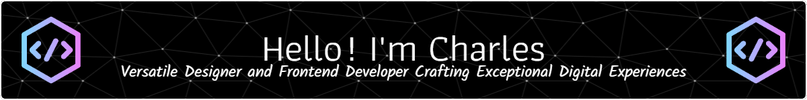

 
&nbsp;
 

 

- 🚀 I’m currently working on my Next React app.

- 🌐 All of my projects are available at charlie-dev.com

- 📧 How to reach me: charli.931@gmail.com, charli.931@aol.com

- 🎨 Fun fact: Passionate about design and frontend engineering, with over 5 years of experience delivering high-quality, user-centric solutions. Committed to excellence in every project, always striving for perfection and continuous improvement.

 

  <h3 align="center">💻 Tech Stack</h3> 

 

 

  

<h2></h2>

    

<h5>Frontend Languages:</h5>

  
  
  
  

<h5>CSS Frameworks:</h5>

  
  
  
  

<h5>JavaScript Libraries/Frameworks:</h5>

  
  
  
  
  
  

<h5>State Management & Validation Libraries:</h5>

  
  

<h5>Build Tools:</h5>

  
  

<h5>Package Managers:</h5>

  
  
  

<h5 align="left">Design Tools:</h5>

  
  
  
  
  
  
  

<h5 align="left">Development Tools:</h5>

  
  
  
  
  
  

  
    
  
  
  
   
  

<h5 align="left">Project Management and Basics in:</h5>

  
  
  
  
  
  

<h3 align="left">🌐 Connect with me:</h3>

  
  
  
  
  

